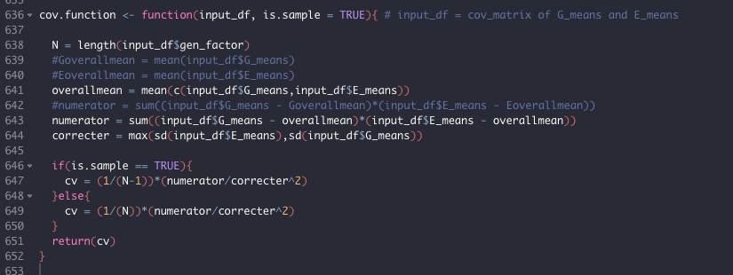

Yesterday Molly and I realized that the CovGE calculation for the population parameter was using the sample variance (divide by n-1, the `sd` function in R) in the 
denominator and not the population variance (divide by n):

The consequence of this will not effect any of our sampling estimates, or confidence intervals. It may affect the power analysis, but that is doubtful 
because those are generally based on whether CovGE is 0 or not.

The consequence will probably be greatest for the comparison between the population parameter and the sampling estimate, and be greatest for when 
2 populations are being compared. It may also affect the analysis of the bootstrap, which is looking to see if the CI are capturing the population parameter, 
and again be greatest for the 2 population case, because as n gets larger, the ratio of n-1 to n gets smaller.

We also discussed how the overall mean was being calculated in this function. At first I thought that for the raw data we should use the overall mean, 
but then I thought that would be a bad idea if the sample sizes are unequal. It makes sense to use the G-means or the E-means, but the G-means and E-means 
should be equal because they are not independent. We need to check this across a wide range of scenarios, including the common garden experiment. The common garden
experiment in particular troubles me, because you only have 2 E-emeans that are being counted several times with the above approach, but you have several G-means.

This approach of taking the mean(c(G-means, E-means)) could potentially get users into trouble if they do not have balanced data (e.g. not a full 
reciprocal transplant or not all pairs in the common garden), so we need to do a full analysis of the ways things could go wrong here, or be absolutely clear in the
discussion about the requirements of the experimental design. 

Maybe a better approach, at least when the raw data are available, are to take the EMM-overall-mean (?).

### TO DO:
- Check that the GxE function does not suffer the same consequences. It could explain why we were getting such wonky results with the GxE bootstrap.
